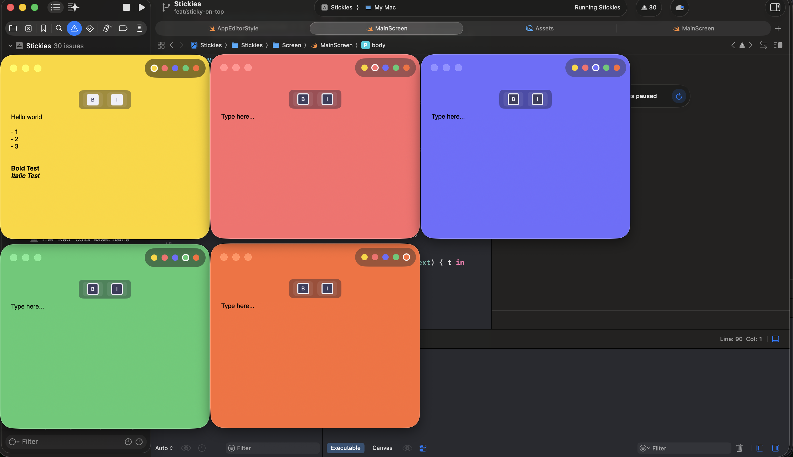

# Stickies · Note important stuff

A macOS sticky notes app floating, colorful, and always on top.
Jot down a thought, slap it on your desktop, and it stays there
until you don't need it anymore.

---

## How It Works

Create a sticky note from the menu bar or with Cmd+N. Each note floats on your desktop as its own window

---

## Screenshots

| Stickies |  |  |
|:----:|:------:|:-----------:|
|  |  |  |

---

## Tech Stack

- **SwiftUI** — All UI, animations, and state management
- **Combine** — Reactive bindings between ViewModel and views

